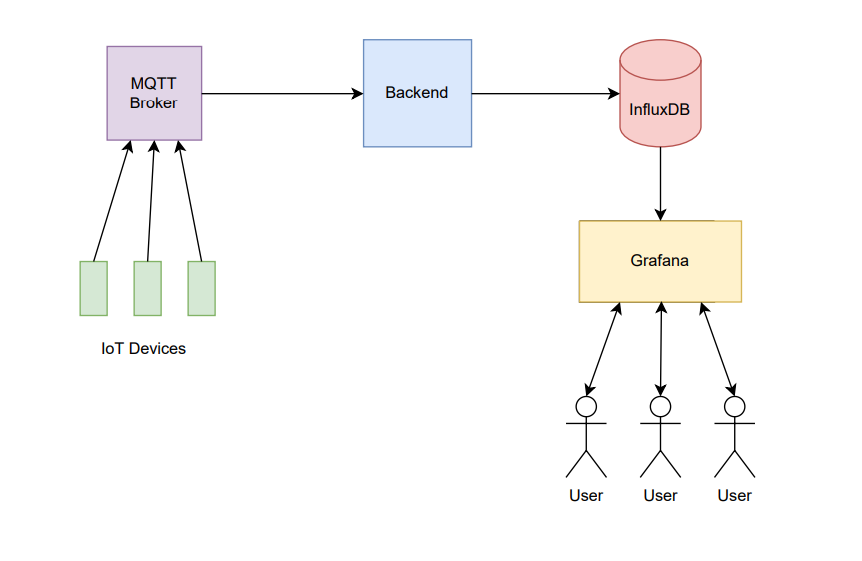

# IoT Monitoring Station
Welcome to the IoT Monitoring Station project repository, developed by Robert-Adrian Popovici (Computer Science Fellow) in collaboration with Open Avenues.

This project is designed to equip students with hands-on experience in building a comprehensive, fully functional IoT monitoring system. Over the course of this 8-week program, students will learn how to collect, process, and visualize live sensor data in a user-friendly and effective way, gaining invaluable skills in both backend and frontend development.

## 1. System Architecture
The following diagram illustrates the architecture of the IoT Monitoring Station system:

### 1.1 IoT Devices
The IoT devices form the core of the data collection process. These devices communicate using the MQTT protocol to send sensor data. During the project, a Python script will be used to simulate these devices. However, in the final session (Session 8), we will demonstrate how to replace the Python-based simulator with a real, virtual ESP32 microcontroller for a more realistic experience.

### 1.2 MQTT Broker
The MQTT Broker acts as the central communication hub in the system, handling the reception, processing, and forwarding of messages. It listens to multiple topics and ensures that data sent by the IoT devices reaches the appropriate destinations. This component facilitates a robust and scalable architecture by decoupling the message producers (IoT devices) and the consumers (Backend).

### 1.3 Backend
The Backend is the core processing engine of the system. It subscribes to all topics from the MQTT Broker, receives incoming data from the IoT devices, processes the data, and writes it into an InfluxDB instance. The Backend is responsible for managing and storing the time-series data, ensuring efficient retrieval and analysis.

### 1.4 InfluxDB
InfluxDB is a lightweight, high-performance time-series database designed for storing and querying data that changes over time, such as sensor metrics. This database stores the data sent by the Backend and provides fast, efficient access for analytics and visualization in Grafana.

### 1.5 Grafana
Grafana is the main UI for visualizing the sensor data. It will use InfluxDB as the data source and provide various time-series graphs and dashboards to display the IoT device metrics. With Grafana, users can monitor and analyze the sensor data in real-time, giving them insights into the performance and status of IoT devices.

## 2. Lessons
The project is divided into 8 lessons, each with specific goals and hands-on activities designed to build key concepts and skills throughout the course.

### 2.1 Lesson 1: Introduction & Setup
In the first lesson, we will introduce the project and get to know each other. We will also guide students through the installation of the necessary applications, packages, and dependencies required for the project. By the end of this lesson, students will be ready to begin hands-on work.

### 2.2 Lesson 2: MQTT and Client-Server Communication
This lesson will focus on client-server architectures, with a particular emphasis on the MQTT protocol. Students will engage in live demonstrations of how to send and receive data using a public MQTT broker. Additionally, students will work in pairs to exchange messages with each other using the broker, gaining a practical understanding of message-based communication.

### 2.3 Lesson 3: Introduction to Docker
In this lesson, we will introduce Docker and explain its significance in modern software development. Students will learn the fundamentals of containerization and its advantages. Through practical demos, they will run Docker containers and learn how to build custom Docker images, setting the foundation for deploying their applications in a containerized environment.

### 2.4 Lesson 4: Docker Compose and Multi-Container Management
This lesson will dive deeper into Docker Compose, a tool for defining and managing multi-container applications. Students will work through several demos to understand how Docker Compose orchestrates multiple containers, helping them to manage complex applications with ease.

### 2.5 Lesson 5: Time-Series Data with InfluxDB
Here, we will introduce time-series databases with a focus on InfluxDB, a powerful solution for storing sensor data over time. Students will learn how to set up an InfluxDB instance using Docker and practice reading and writing data to the database, which will serve as the foundation for the real-time monitoring application.

### 2.6 Lesson 6: Visualizing Data with Grafana
In this lesson, we will introduce Grafana, a leading open-source tool for data visualization. Students will set up an InfluxDB datasource in Grafana and learn how to create customized dashboards to visualize IoT data in various time-series plots. By the end of this session, students will be able to see live data from their IoT devices on Grafana dashboards.

### 2.7 Lesson 7: Final Project Work and Deployment
This lesson will be dedicated to answering any remaining questions and providing students with guidance as they work to finalize their projects. If time allows, we will deploy the entire application on a public server using Play with Docker, making the project accessible to all participants.

### 2.8 Lesson 8: Final Presentations & ESP32 Demo
In the final lesson, students will present their completed projects. The fellow will provide feedback and evaluate each project. If time allows, we will demonstrate the use of a virtual ESP32 microcontroller, replacing the Python IoT sensor script with real hardware to make the experience more immersive.

## 3. Conclusion
By the end of the 8-week program, students will have built a fully functional IoT Monitoring Station, with a clear understanding of how to:

Collect data from IoT devices using MQTT.
Process and store time-series data in InfluxDB.
Visualize data using Grafana dashboards.
Deploy and manage containerized applications using Docker and Docker Compose.
This project not only gives students practical experience with IoT systems, but also provides hands-on exposure to essential tools and technologies used in the industry, including MQTT, InfluxDB, Grafana, and Docker.

